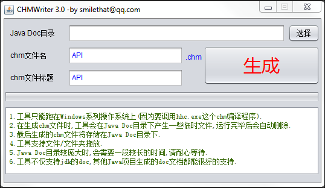

javadoc2chm
===========

**历史尘埃-缘由**

最初想到用javadoc2chm这个工具,是公司同事用到[mockito](http://mockito.org/)做单元测试,看到代码十分易懂,而且功能十分强大,
于是找到了其官方文档看一看,发现文档写的也非常好.于是就想下载成`.chm`格式,不用每次上网搜索.

**操作说明**

双击"CHMWriter.exe",
在弹出的窗口中,
输入:
1.java doc文档目录(例如D:\JavaLib\hibernate2\hibernate-2.1\doc\api,或直接将doc文档目录或doc文档目录下的任一文件拖进窗口),
2.待生成的chm文件名(例如hibernate-2.1),
3.chm文件标题(例如hibernate-2.1 JavaDoc),
点击"生成"按钮即可.
生成的chm文件位于java doc文档目录下,例如D:\JavaLib\hibernate2\hibernate-2.1\doc\api\hibernate-2.1.chm

**版本**

- `V1.1`

> 解决了V1.0检索的一些bug

- `V1.2`

> 解决了V1.1中文乱码问题

- `v1.3`

> 优化了内存,极大地降低了解析体积庞大的doc文档对内存的需求

- `V2.0`

> 使用Swing图形界面,不再是运行于命令行下;
修改了生成索引的算法,
不仅能输入类名,还能够输入方法名进行检索,
并且在检索时,对于多个同名的类或方法,程序提供了一个页面供用户进行选择.

- `V2.1`

> 使用了H2本地数据库,来提高程序的性能;
支持最新Java Doc目录结构;
解决了索引生成算法的若干个bug.

- `V2.2`

> 修正了目录文件生成时的一个bug.

- `v3.0`

> 替换体积庞大的ORM库Hibernate为小巧的iBatis,并彻底解决了中文乱码问题.

**相关**

- [ruby写的javadoc2chm](https://github.com/tanakahisateru/javadoc2chm)

- [Zeal](http://zealdocs.org/):Zeal is a simple offline API documentation browser inspired by Dash (OS X app), available for Linux and Windows.
- [Java documentation in Windows Help format
Searching the Java documentation made easy !](http://www.allimant.org/javadoc/):网站推荐的两个javadoc2chm工具
    - [Javadoc To CHM](http://www.burgaud.com/jd2chm/)
    - [javadoc to chm conversion](http://jan.baresovi.cz/dr/en/javadoc-chm)

- [Javadoc转换chm帮助文档的四种方法总结](http://www.blogjava.net/lishunli/archive/2010/01/07/308618.html)

**用法**

- 第一步:使用爬虫或工具[Teleport Ultra](http://www.pc6.com/softview/SoftView_25196.html#downloadTeleport Ultra)下载[mockito api page](http://site.mockito.org/mockito/docs/current/index.html?overview-summary.html)或[spring-rich api page](http://spring-rich-c.sourceforge.net/1.1.0/apidocs/)地址,下载后的文件为`.html`
- 第二步:使用`javadoc2chm`工具,生成`.chm`文件
- 第三步:Enjoying! :simle:

